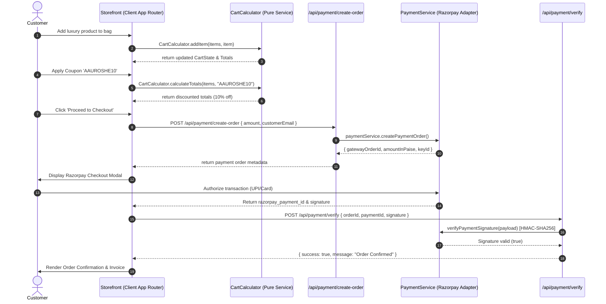
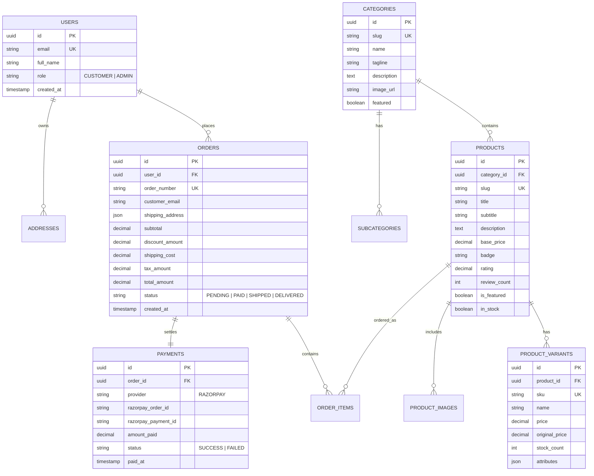

# AAUROSHE — Architectural & UML Diagrams

This document contains architectural diagrams, UML models, sequence flows, and data entity schemas for the **AAUROSHE Luxury E-Commerce Platform** (Quotation V1.0).

---

## 1. Atomic Component Architecture (Class & Structural Hierarchy)

```mermaid
classDiagram
    direction TB
    
    namespace Atoms {
        class Button {
            +variant: "primary" | "gold" | "outline" | "ghost"
            +size: "sm" | "md" | "lg"
            +isLoading: boolean
        }
        class Badge {
            +type: ProductBadge
            +label: string
        }
        class PriceTag {
            +price: number
            +originalPrice: number
            +formatINR()
        }
        class RatingStars {
            +rating: number
            +reviewCount: number
        }
    }

    namespace Molecules {
        class ProductCard {
            +product: Product
            +handleQuickAdd()
        }
        class CategoryCard {
            +category: CategoryDefinition
        }
        class QuantitySelector {
            +quantity: number
            +max: number
            +onChange()
        }
        class CartItemRow {
            +item: CartItem
            +onUpdateQuantity()
            +onRemove()
        }
        class SearchBar {
            +query: string
            +onSearch()
        }
        class FilterPill {
            +label: string
            +isActive: boolean
        }
    }

    namespace Organisms {
        class Navbar {
            +stickyScrolledState
            +cartTrigger
            +mobileMenu
        }
        class HeroBanner {
            +editorialBackground
            +valueStrip
        }
        class CategoryShowcase {
            +tenMaisonsGrid
        }
        class ProductGrid {
            +categoryFilter
            +sortingEngine
        }
        class CartDrawer {
            +freeShippingIndicator
            +couponEngine
            +checkoutRedirect
        }
        class Footer {
            +brandStory
            +policies
        }
    }

    namespace Templates {
        class StorefrontLayout {
            +Navbar
            +CartDrawer
            +Footer
        }
    }

    Button ..> ProductCard : utilizes
    PriceTag ..> ProductCard : utilizes
    Badge ..> ProductCard : utilizes
    RatingStars ..> ProductCard : utilizes
    ProductCard ..> ProductGrid : composed in
    CategoryCard ..> CategoryShowcase : composed in
    QuantitySelector ..> CartItemRow : utilizes
    CartItemRow ..> CartDrawer : composed in
    Organisms ..> StorefrontLayout : embedded in
```

---

## 2. Sequence Diagram: Cart -> Checkout -> Razorpay Payment Gate (Modules 4 & 5)



---

## 3. Entity Relationship Diagram (PostgreSQL Data Model)


